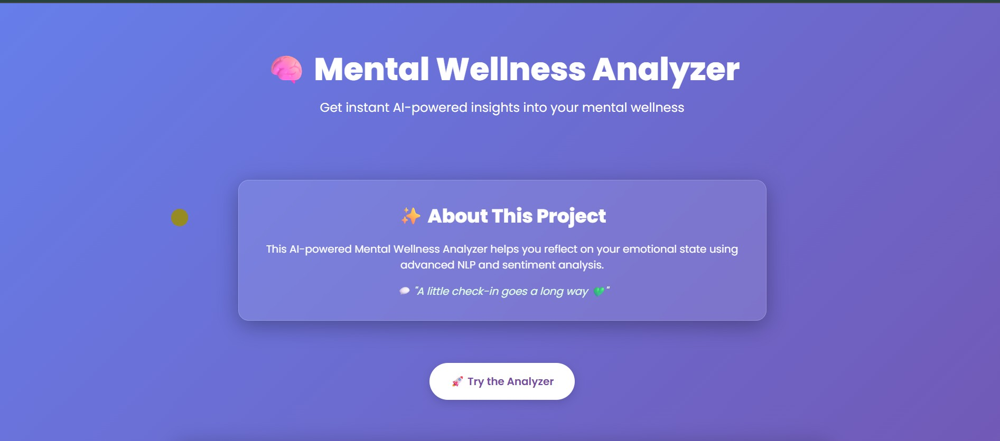
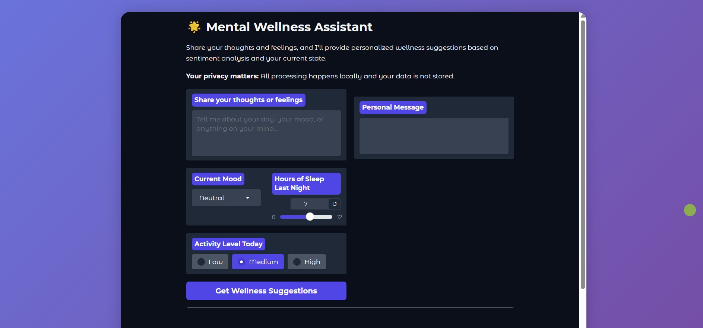

# 🧠 Mental Wellness Analyzer

> ✨ A lightweight, AI-powered web app that helps users reflect on their mental well-being, get instant mood analysis, and receive personalized, empathetic suggestions.  
> 💬 _"A little check-in goes a long way."_

---

## 🌐 Live Demo

🔗 Try it live here: [Demo](https://mental-wellness-analyzer.vercel.app/)

---

## 💡 About the Project

Mental Wellness Analyzer is a beautiful and responsive frontend application that:
- 🧠 Uses AI models to understand user mood and suggest personalized actions
- 💬 Analyzes free-text input using sentiment classification
- 🧘‍♀️ Delivers calming, supportive responses generated using instruction-tuned LLM
- 🎨 Features glowing animations, custom cursor trails, glassmorphism, and smooth UI
- ⚡ Runs fully on the web – no login, no database, no hassle

---

## ✨ Features

- ✅ Gradio-powered AI mental wellness assistant
- 🎯 Sentiment detection: positive, neutral, or negative
- 💬 Personalized suggestions based on mood, sleep, and activity
- 🧘‍♀️ Natural language supportive message generation
- 🎨 Frontend enhancements:
  - Dot-trail animated cursor
  - Glass-effect cards
  - Gradient hero section
- 🚀 Hosted with Vercel + Hugging Face Spaces

---

## 🧠 Models Used

The backend uses two state-of-the-art Hugging Face models:

| Task                         | Model                                                                 |
|------------------------------|------------------------------------------------------------------------|
| **Sentiment Analysis**       | [`cardiffnlp/twitter-roberta-base-sentiment-latest`](https://huggingface.co/cardiffnlp/twitter-roberta-base-sentiment-latest)  
| **Personalized Message Generation** | [`mistralai/Mistral-7B-Instruct-v0.1`](https://huggingface.co/mistralai/Mistral-7B-Instruct-v0.1) |

- **Sentiment Model**: RoBERTa-based model fine-tuned on Twitter data to detect sentiment in user text.  
- **Response Generator**: Instruction-tuned large language model used to generate thoughtful, empathetic responses.

---

## 👥 Contributors

Huge thanks to the team behind this project 👇

| Name              | GitHub                                              | Role                       |
|-------------------|-----------------------------------------------------|----------------------------|
| 🧑‍💻 Khushi Bhaskar | [@khushi-bhaskr](https://github.com/khushi-bhaskr) | Backend + AI Integration   |
| 🎨 Aman Kumar      | [@Amank07-debug](https://github.com/Amank07-debug)         | UI/UX Design + Animations  |
| 💻 Teammate 2      | [@teammate2](https://github.com/teammate2)         | Frontend Development       |


---

## 🖼️ Screenshots


| Homepage | Analyzer Panel |
|----------|----------------|
|  |  |

---

## ⚙️ How to Run Locally

```bash
git clone https://github.com/your-username/mental-wellness-analyzer
cd mental-wellness-analyzer
open index.html in your browser

```

## 🚀 Deployment

- **Frontend**: Hosted on [Vercel](https://vercel.com/)
- **Backend (Gradio App)**: Hosted on [Hugging Face Spaces](https://huggingface.co/spaces/Khushi-bhaskr/MoodBooster-AI)

---

Made with 💜 by Team ByteBuddies
